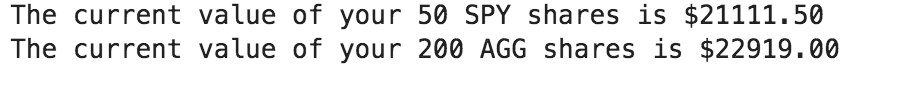
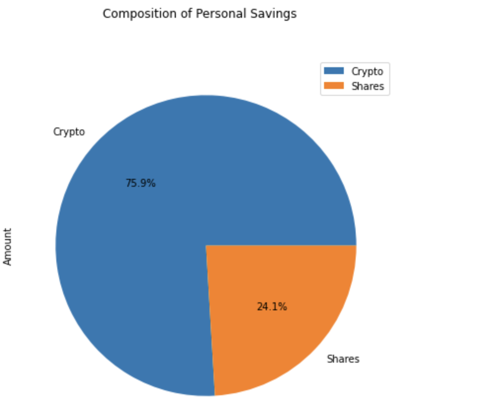
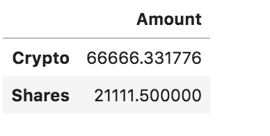
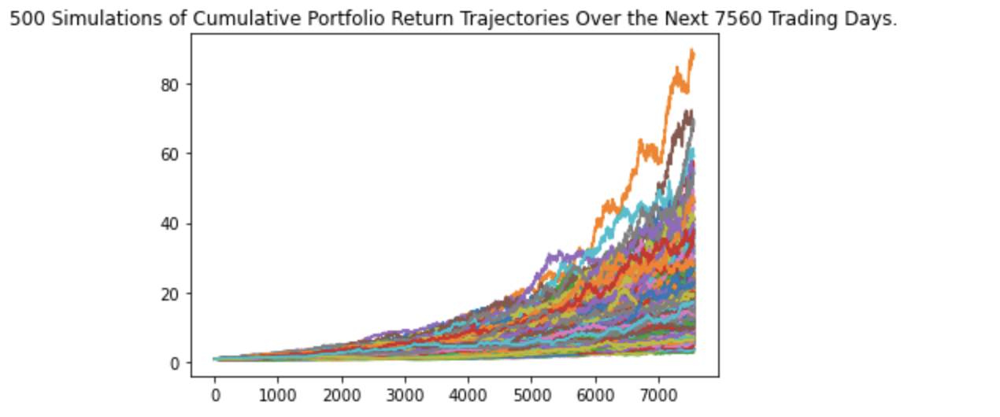
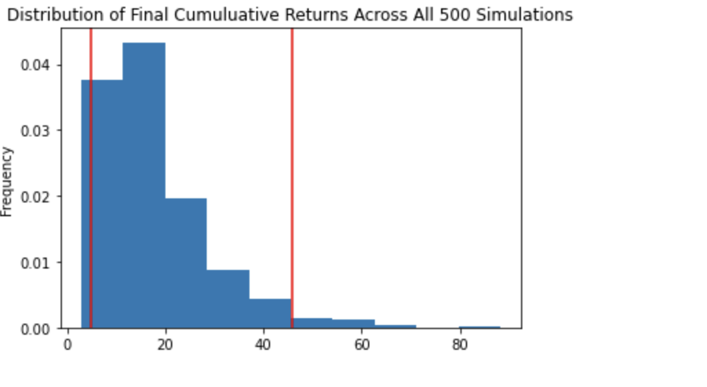
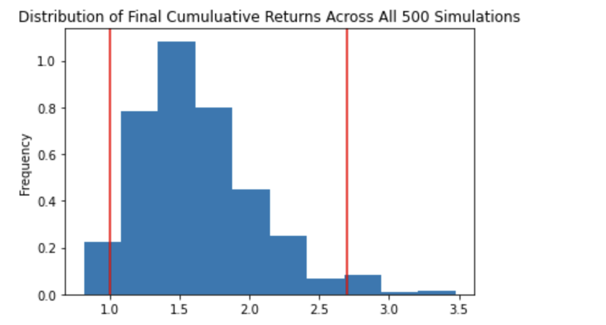
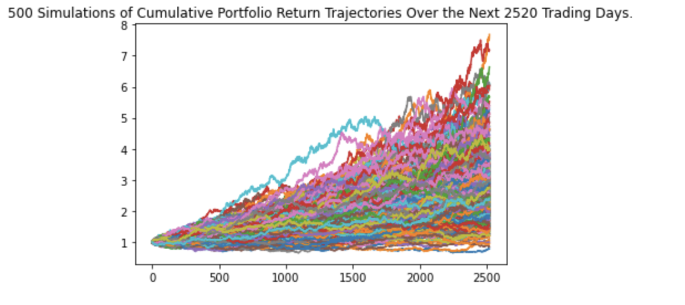
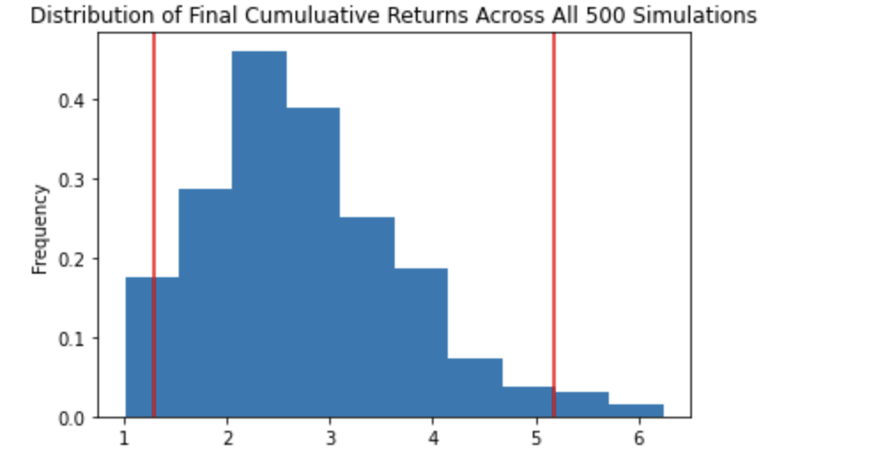

# **Financial-Planning**

## **Background**
A FinTech consultancy firm has won your first contract to help one of the biggest credit unions in the area. They want to create a tool that helps their members enhance their financial health. The Chief Technology Officer (CTO) of the credit union asked the company to develop a prototype application to demo in the next credit union assembly.
The credit union board wants to allow the union's members to assess their monthly personal finances, and also be able to forecast a reasonably good retirement plan based on cryptocurrencies, stocks, and bonds.

---

### **Objective**
To create two financial tools:
* The first will be a personal finance planner that will allow users of credit union to visualize their savings composed by investments in shares and cryptocurrencies to assess if they have enough money as an emergency fund.
* The second tool will be a retirement planning tool that will use historical closing prices for a retirement portfolio composed of stocks and bonds, then run Monte Carlo simulations to project the portfolio performance at 30 years. 

---
### **Steps**
**Part 1: Personal Finance Planner**

1. Using the **Alternative Free Crypto API** to get the current value of Bitcoin and Ethereum and calculate the value of crypto
2. Using the **Alpaca Markets API** get the value of stock ('SPY') and bonds ('AGG') and compute the current value

**Part 2: Savings Health Analysis**

1. Assumming Monthly Income of $12000, calculate Saving = Value of Crypto portfolio and Value of Stock & Bond portfolio
2. Compare Savings with Emergency Fund ( assumed as 3 times of Monthly Income) and assess whether savings are sufficient

**Part 3 : Retirement Planning**

1.  Run MonteCarlo Simulation for 30 years on the portfolio of 40/60 Bond-stock portfolio consisting of AGG and SPY
2. Display simulation results and Plot Cumulative Returns 
3. Run MonteCarlo Simulation for 5 years the portfolio of 40/60 Bond-stock portfolio consisting of AGG and SPY
4. Display 5 year simulation results
5. Similarly Run simulation for 10 years for the same portfolio and display 10 year simulation results

---

### **Technologies/Tools**
* Python
* Alpaca Markets API
* Alternative Free Crypto API
* Pandas
* Matplotlib

---

### **Data**
Historical Data required is sourced from **Alpaca Markets API** and **Alternative Free Crypto API**

---

### **Code**
* [Main ](financial-planner.ipynb)
* [Python Module for MonteCarlo Simulation](MCForecastTools.py)

---

### **Output**
The outputs are inline in the Jupyter Notebook

**Sample Outputs**

* Value of Crypto 

* Value of Portfolio

* Composition of Savings

* Montecarlo Simulation of Retirement Portfolio for 30 years

* Montecarlo Simulation of Retirement Portfolio for 5 years

* Montecarlo Simulation of Retirement Portfolio for 10 years

