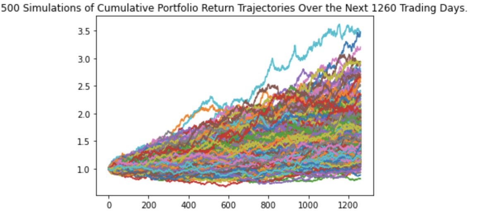

# **Financial-Planning**

## **Background**
A FinTech consultancy firm has won your first contract to help one of the biggest credit unions in the area. They want to create a tool that helps their members enhance their financial health. The Chief Technology Officer (CTO) of the credit union asked the company to develop a prototype application to demo in the next credit union assembly.
The credit union board wants to allow the union's members to assess their monthly personal finances, and also be able to forecast a reasonably good retirement plan based on cryptocurrencies, stocks, and bonds.

---

### **Objective**
To create two financial tools:
* The first will be a personal finance planner that will allow users of credit union to visualize their savings composed by investments in shares and cryptocurrencies to assess if they have enough money as an emergency fund.
* The second tool will be a retirement planning tool that will use historical closing prices for a retirement portfolio composed of stocks and bonds, then run Monte Carlo simulations to project the portfolio performance at 30 years. 

---
### **Steps**

---

### **Technologies/Tools**
* Python
* Alpaca Markets API
* Alternative Free Crypto API
* Pandas
* Matplotlib

---

### **Data**
Historical Data required is sourced from **Alpaca Markets API** and **Alternative Free Crypto API**

---

### **Code**
* [Main ](financial-planner.ipynb)
* [Python Module](MCForecastTools.py)

--

### **Output**
The outputs are inline in the Jupyter Notebook

**Sample Outputs**

* Value of Crypto 

* Value of Portfolio

* Composition of Savings

* Montecarlo Simulation of Retirement Portfolio for 30 years

* Montecarlo Simulation of Retirement Portfolio for 5 years

* Montecarlo Simulation of Retirement Portfolio for 10 years

